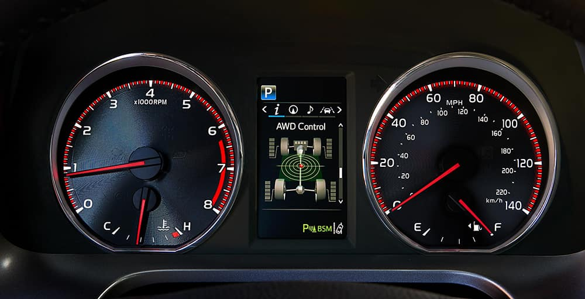
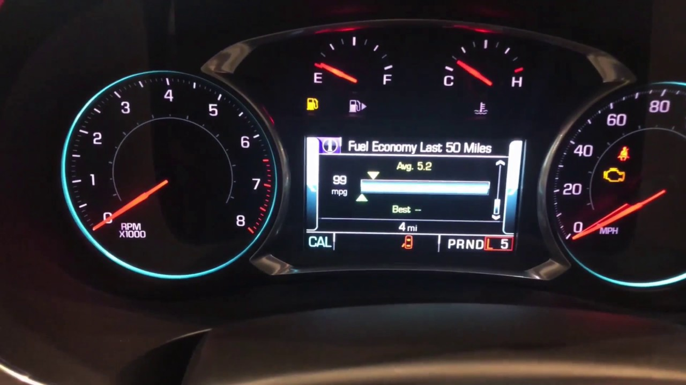
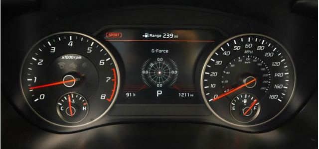
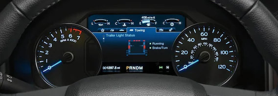
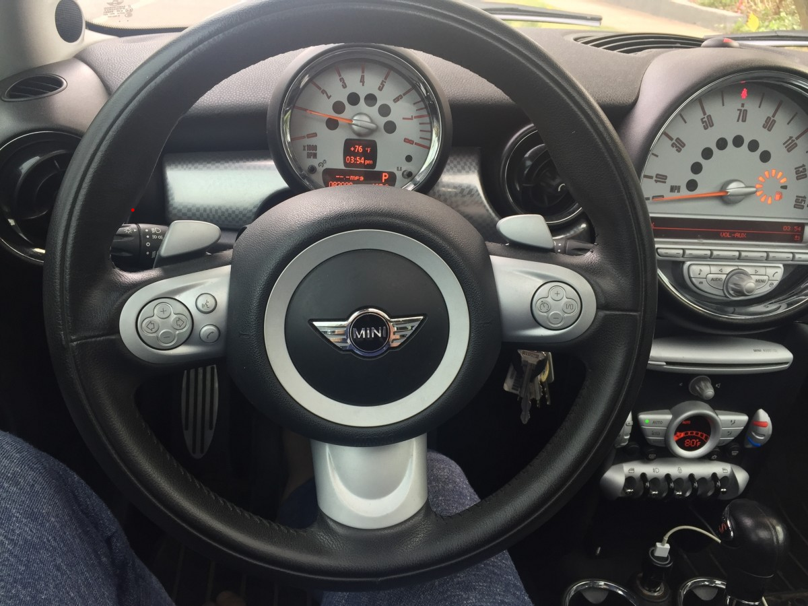

# Jordan Miller CS 4331 Project 2 CS-4331-Project-2

## Modern Dash Examples ##

### Pros ###
    1. Fuel gauge in central location
    2. Obvious that the Tachometer is a Tachometer and that a speedometer is a speedmeter
    3. Simple

### Cons ###
    1. Have to change screens in the center to see the odometer 
    2. The different warning symbols are in different places
    3. Car Door Open is very small on the screen
These are overall good designs but they do have some slight things that can be improved on.
# Good Design

This is a very good design because all of the major meters and gauges (odemeter and fuel gauge) are all easily accessed and avaible at all times. The driver does not have to fiddle with the middle screen to access any of the gauges. Also, the speedometer and tachometer are easily distiguishable from each other because the tachometer is smaller and has a completely different style and size.

# Bad Design 

I consider this a bad design because a lot of the features of a car dashboard that a user uses is all over the place and not presented in a conventional way. 
1. The spedometer is in the middle of the car the driver would have to look away to see it 
2. The tachometer is small and a new user might confuse it with a speedometer
3. The time and temperature are in front of the driver when the area could have been used for other information
4. Many of the other features such as the oil gauge and engine temperature are not easily seen. 

# Common Features 
    - Meters (tachometer and speedometer)
    - Gauges (Fuel gauge)
    - Gear
    - Door open indicators
    - Trunk open indicators
    - Lights
    - MPG
# "New and Rare Uses"
    - Sleep indicator (tells user that they need a break)
    - Ice Warnings
    - Radar and car distance (tells user how far away a car is)
    - Lane change indicators
    - Mode changes 
# Controls the user interacts with on the dashboard
    - Cruise control
    - Lights
    - Gear/Shift
    - Accelerator (through the meters)
    - Parking Break

